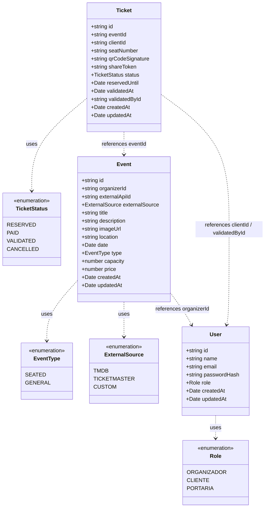
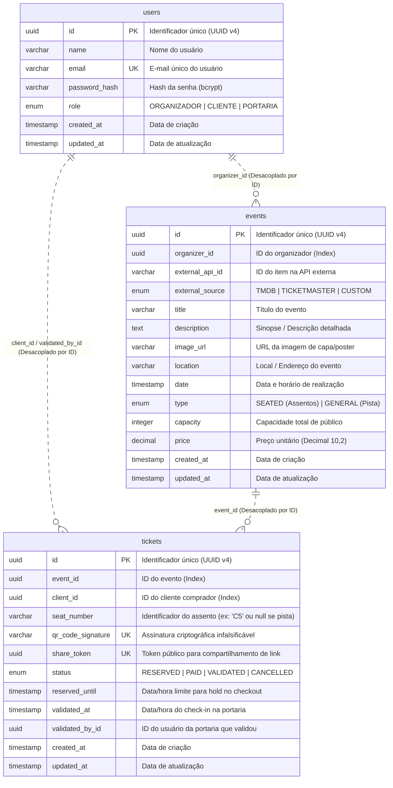

# 📐 Arquitetura do Sistema & Modelagem de Dados

Este documento descreve a arquitetura do back-end (`api`), a divisão de responsabilidades por módulos (*Modular Monolith com Bounded Contexts*) e a modelagem do banco de dados (Diagrama de Classes e Diagrama Entidade-Relacionamento).

---

## 🏛️ 1. Visão Geral da Arquitetura

A aplicação foi estruturada seguindo os princípios de **Domain-Driven Design (DDD)** em um **Monolito Modular**. Cada módulo é independente e responsável por seu próprio ciclo de vida, comunicando-se por meio de identificadores escalares (IDs) e contratos de serviço, sem acoplamento direto no nível de ORM.

```mermaid
graph TD
    Client((Cliente / SPA))
    
    subgraph Modular Monolith (API)
        Identity[📦 Identity Module<br><i>Auth, JWT, RBAC</i>]
        Integrations[📦 Integrations Module<br><i>TMDb, Ticketmaster ACL</i>]
        Events[📦 Events Module<br><i>Catálogo, Gestão de Eventos</i>]
        Tickets[📦 Tickets Module<br><i>Reservas, Pagamento, QR Code, Portaria</i>]
        
        Events -.->|Anti-Corruption Layer| Integrations
        Tickets -.->|Referência por Event ID| Events
        Tickets -.->|Referência por User ID| Identity
        Events -.->|Referência por Organizer ID| Identity
    end
    
    Client --> Identity
    Client --> Events
    Client --> Tickets
```

### 🧩 Bounded Contexts (Módulos)
1. **`identity`**: Responsável pelo cadastro, autenticação, controle de acesso baseado em papéis (`ORGANIZADOR`, `CLIENTE`, `PORTARIA`) e emissão de tokens JWT.
2. **`integrations`**: Camada anti-corrupção (ACL) responsável por consumir APIs externas (TMDb e Ticketmaster Discovery) e normalizar seus dados.
3. **`events`**: Gerenciamento e ciclo de vida dos eventos (criação, edição, listagem pública com busca e filtros, definição de assentos ou capacidade).
4. **`tickets`**: Core de reservas, checkout simulado, geração de QR Code seguro (HMAC-SHA256), links de compartilhamento e validação de entrada na portaria.

---

## 📊 2. Diagrama de Classes

Representa as entidades de domínio e os enums utilizados no sistema:



---

## 🗄️ 3. Diagrama Entidade-Relacionamento (DER)

Estrutura física do banco de dados no PostgreSQL (gerenciado pelo Prisma ORM), contendo todas as chaves primárias (PK), chaves únicas (UK) e índices de performance:



---

## 🔒 4. Decisões Arquiteturais Relevantes

### 4.1. Desacoplamento entre Entidades
Para respeitar as fronteiras dos Bounded Contexts, **nenhum modelo do Prisma possui anotação `@relation` cruzando fronteiras de módulos**.
- A tabela `events` guarda apenas `organizer_id` como campo escalar.
- A tabela `tickets` guarda apenas `event_id`, `client_id` e `validated_by_id`.
- **Benefício**: Permite que qualquer módulo seja escalado, modificado ou até extraído para um microsserviço independente sem quebrar modelos de outros módulos.

### 4.2. Segurança e QR Code Infalsificável
- O campo `qr_code_signature` contém uma assinatura HMAC-SHA256 gerada com um segredo do servidor (`QR_SIGNING_SECRET`) a partir do payload `ticketId:eventId`.
- Ao ler o QR Code na portaria, o sistema valida a integridade da assinatura criptográfica antes de consultar o status no banco, impedindo que ingressos falsificados sejam gerados por terceiros.

### 4.3. Link Compartilhável Seguro (`share_token`)
- O campo `share_token` (UUID v4 único) permite gerar URLs públicas seguras (ex: `/tickets/share/:token`) para que o comprador compartilhe o ingresso com um amigo sem expor seu ID interno ou exigir autenticação do terceiro.

### 4.4. Índices para Otimização e Concorrência
- `events(organizer_id)`: Agiliza a busca de eventos criados por um organizador específico.
- `tickets(event_id, status)`: Otimiza a contagem de ingressos vendidos/disponíveis e a checagem de ocupação de assentos.
- `tickets(client_id)`: Acelera a consulta da tela "Meus Ingressos".
- `tickets(share_token)` e `tickets(qr_code_signature)`: Índices únicos para busca instantânea em O(1).
